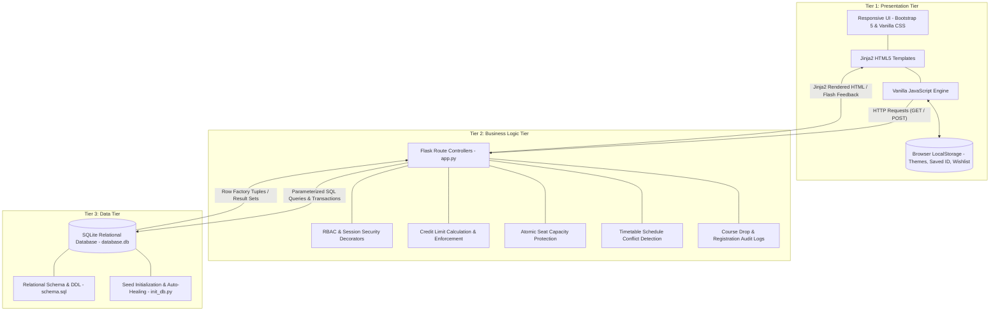

# 3-Tier Architecture Specification

## CampusEnroll – University Course Registration Portal

This system adheres strictly to the classic **3-Tier Software Architecture** pattern. Each tier has distinct, decoupled responsibilities, ensuring modularity, security, ease of testing, and maintainability.

---

## 1. Tier 1: Presentation Tier (Client / Frontend)

The **Presentation Tier** handles user interaction, visual presentation, and client-side convenience.

### Components:
1. **Dynamic HTML5 Templates (Jinja2)**:
   - Base template inheritance (`templates/base.html`) providing consistent layouts, navigation, and contextual user badges.
   - Distinct student and administrative view templates (`dashboard.html`, `courses.html`, `my_courses.html`, `timetable.html`, `profile.html`, `admin_*.html`).
2. **Design System & Theme Engine (Vanilla CSS)**:
   - Custom CSS variables (`static/css/style.css`) supporting **Light Mode**, **Dark Mode**, and **System Auto Mode**.
   - Zero-flicker `<head>` execution script ensuring instant theme loading without blinding flashes.
   - High-contrast accessible typography with dedicated dark mode overrides.
   - Fully responsive layout utilizing Bootstrap 5 grid utilities.
3. **Client-Side Engine (`static/js/script.js`)**:
   - Asynchronous real-time DOM filtering for courses and student tables.
   - Auto-dismissing alerts and confirmation dialogs before destructive actions (Drop / Delete).

### LocalStorage Persistence:
- **Theme Preference**: Persists `'light'`, `'dark'`, or `'system'` preference in `localStorage.getItem('theme')`.
- **Remembered Student ID**: Automatically saves and restores student roll code (`BWU/BTA/23/576`) via `localStorage.getItem('campusenroll_saved_student_id')`.
- **Course Wishlist & Bookmarking**: Persists student's starred course IDs in `localStorage.getItem('campusenroll_saved_courses')` with instant client-side filtering.

---

## 2. Tier 2: Application / Business Logic Tier (Server / Controller)

The **Application Tier** orchestrates business rules, enforces university policies, and guards data integrity. It is implemented in **Python Flask** ([app.py](file:///d:/Student%20Course%20Registration%20System/app.py)).

### Core Responsibilities:
1. **Role-Based Access Control (RBAC)**:
   - `@student_required`: Validates that the active session belongs to an authenticated student.
   - `@admin_required`: Restricts catalog management, student directories, and registration audits to university administrators.
2. **Registration Safeguards (4-Tier Server Validation)**:
   - **Duplicate Detection**: Queries composite uniqueness (`student_id`, `course_id`) before enrollment.
   - **Credit Limit Verification**: Aggregates enrolled credits and prevents exceeding `MAX_CREDIT_LIMIT` (24 credits).
   - **Seat Capacity Protection**: Verifies `available_seats > 0` before decrementing.
   - **Schedule Collision Detection**: Prevents enrolling in simultaneous lecture slots.
3. **Atomic SQL Transactions**:
   - Orchestrates multi-statement updates (e.g. creating registration record + decrementing seat count) within atomic `conn.commit()` / `conn.rollback()` boundaries.
4. **Smart Environment Safeguards**:
   - Native `.env` loader with safe fallbacks.
   - Self-healing database initialization if `database.db` is missing on a new system.
   - Security header injection (`X-Content-Type-Options`, `X-Frame-Options`, `X-XSS-Protection`).

---

## 3. Tier 3: Data Tier (Persistence / Storage)

The **Data Tier** provides persistent, ACID-compliant storage using an embedded **SQLite relational database** ([database.db](file:///d:/Student%20Course%20Registration%20System/database.db)).

### Schema Structure:
- **`students`**: Stores identity, credentials, degree program, department (`B.Tech CSE (AI & ML)`), semester, and contact.
- **`admins`**: Stores administrative credentials for course management.
- **`courses`**: Stores course codes, titles, credits, faculty, capacities, and weekly class schedules.
- **`registrations`**: Many-to-Many junction table linking students to courses with enrollment timestamps and composite unique constraints (`UNIQUE(student_id, course_id)`).

### Integrity Mechanisms:
- **Foreign Key Enforcement**: `PRAGMA foreign_keys = ON;` enabled on every connection.
- **Cascade Deletions**: Deleting a course automatically removes orphan registration records.
- **Check Constraints**: `CHECK(available_seats >= 0)` guarantees negative seats are physically impossible.
