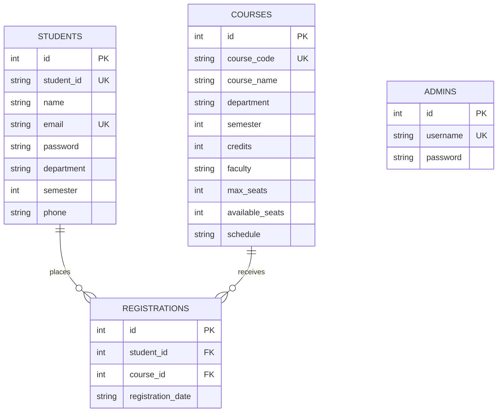

# Database Design Specification
## CampusEnroll – Student Course Registration System

### 1. Database Overview
The application utilizes **SQLite 3**, a lightweight, serverless relational database engine. Relational integrity is enforced using foreign key pragmas (`PRAGMA foreign_keys = ON`), composite unique constraints, and check conditions.

---

### 2. Entity-Relationship (ER) Diagram



---

### 3. Relational Table Schemas

#### 3.1 Table: `students`
Stores undergraduate and graduate student profile and credential records.

| Column Name | Data Type | Constraints | Description |
| :--- | :--- | :--- | :--- |
| `id` | INTEGER | PRIMARY KEY, AUTOINCREMENT | Internal synthetic identifier |
| `student_id` | TEXT | UNIQUE, NOT NULL | University student roll number (e.g., BWU/BTA/23/576) |
| `name` | TEXT | NOT NULL | Full student name |
| `email` | TEXT | UNIQUE, NOT NULL | Registered university email address |
| `password` | TEXT | NOT NULL | Student account password |
| `department` | TEXT | NOT NULL | Academic branch (e.g., CSE, AI & ML) |
| `semester` | INTEGER | NOT NULL | Current active semester (e.g., 1 to 8) |
| `phone` | TEXT | NULLABLE | Student mobile contact number |

---

#### 3.2 Table: `admins`
Stores system administrator credentials for catalog management.

| Column Name | Data Type | Constraints | Description |
| :--- | :--- | :--- | :--- |
| `id` | INTEGER | PRIMARY KEY, AUTOINCREMENT | Internal primary key |
| `username` | TEXT | UNIQUE, NOT NULL | Administrator username |
| `password` | TEXT | NOT NULL | Administrator password |

---

#### 3.3 Table: `courses`
Stores academic courses, instructor assignments, credit weights, and seating limits.

| Column Name | Data Type | Constraints | Description |
| :--- | :--- | :--- | :--- |
| `id` | INTEGER | PRIMARY KEY, AUTOINCREMENT | Internal course identifier |
| `course_code`| TEXT | UNIQUE, NOT NULL | Official course catalog code (e.g., CS301) |
| `course_name`| TEXT | NOT NULL | Descriptive course title |
| `department` | TEXT | NOT NULL | Offering department |
| `semester` | INTEGER | NOT NULL | Targeted semester |
| `credits` | INTEGER | NOT NULL, CHECK(credits > 0) | Academic credit load (typically 3 or 4) |
| `faculty` | TEXT | NOT NULL | Assigned professor or lecturer name |
| `max_seats` | INTEGER | NOT NULL, CHECK(max_seats > 0) | Total classroom seating quota |
| `available_seats`| INTEGER | NOT NULL, CHECK(available_seats >= 0) | Remaining open seats |
| `schedule` | TEXT | NOT NULL | Weekday and time slot specification |

---

#### 3.4 Table: `registrations`
Represents the Many-to-Many associative table between `students` and `courses`.

| Column Name | Data Type | Constraints | Description |
| :--- | :--- | :--- | :--- |
| `id` | INTEGER | PRIMARY KEY, AUTOINCREMENT | Enrollment transaction ID |
| `student_id` | INTEGER | FOREIGN KEY -> students(id) ON DELETE CASCADE | Reference to student |
| `course_id` | INTEGER | FOREIGN KEY -> courses(id) ON DELETE CASCADE | Reference to course |
| `registration_date`| TEXT | NOT NULL, DEFAULT CURRENT_TIMESTAMP | Timestamp of enrollment |

**Composite Unique Constraint:**
`UNIQUE(student_id, course_id)` ensures that a student can never be enrolled into the identical course twice at the database level.

---

### 4. Database Normalization (Up to 3NF)

1. **First Normal Form (1NF)**:
   - Each column contains atomic (indivisible) values.
   - Every table features a declared primary key (`id`).
   - Repeating groups of columns have been decomposed into associative tables (`registrations`).

2. **Second Normal Form (2NF)**:
   - The tables meet 1NF criteria.
   - All non-key attributes are fully functionally dependent on the primary key, eliminating partial dependencies.

3. **Third Normal Form (3NF)**:
   - The schema meets 2NF criteria.
   - No transitive functional dependencies exist (no non-key attribute depends on another non-key attribute). Course properties (faculty, schedule, credits) depend solely on the course key, not on the student or registration.

---

### 5. Critical Database Transactions

#### 5.1 Atomic Course Registration:
```sql
-- Step 1: Record registration entry
INSERT INTO registrations (student_id, course_id)
VALUES (?, ?);

-- Step 2: Decrement remaining seats atomically
UPDATE courses 
SET available_seats = available_seats - 1 
WHERE id = ? AND available_seats > 0;
```

#### 5.2 Atomic Course Drop:
```sql
-- Step 1: Remove registration record
DELETE FROM registrations 
WHERE student_id = ? AND course_id = ?;

-- Step 2: Restore available seat
UPDATE courses 
SET available_seats = MIN(max_seats, available_seats + 1)
WHERE id = ?;
```
