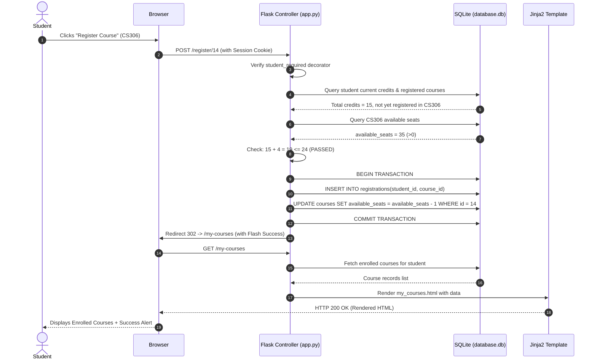

# System Architecture Specification
## CampusEnroll – Student Course Registration System

### 1. Architectural Style: Model-Template-View (MTV / Layered MVC)

CampusEnroll adopts the standard Python web application architecture (Layered MVC / MTV):

```
+--------------------------------------------------------------+
|                     Client Presentation Tier                 |
|     (HTML5, CSS3, Bootstrap 5 CDN, Vanilla JavaScript)      |
+--------------------------------------------------------------+
                              |   HTTP Requests / JSON / Forms
                              v
+--------------------------------------------------------------+
|                   Controller & Routing Layer                 |
|             (Flask Application in app.py & Routes)           |
+--------------------------------------------------------------+
                              |
       +----------------------+----------------------+
       |                                             |
       v                                             v
+-----------------------------+       +-----------------------------+
|    Business Rules Layer     |       |    Template Engine Layer    |
| - Credit Limit Guard (<=24) |       |  (Jinja2 Template Engine    |
| - Seat Availability Check   |       |   renders HTML with context |
| - Role Access Decorators    |       |   and Flash messages)       |
+-----------------------------+       +-----------------------------+
       |
       v
+--------------------------------------------------------------+
|               Data Access & Persistence Layer                |
|           (Python sqlite3, Parameterized SQL Queries)        |
+--------------------------------------------------------------+
                              |
                              v
+--------------------------------------------------------------+
|                    Physical Database                         |
|                    (SQLite database.db)                      |
+--------------------------------------------------------------+
```

---

### 2. Layer Descriptions

#### 2.1 Presentation Tier (Client Layer)
- **HTML5 & Semantic Markup**: Structured templates extended from a single layout master `templates/base.html`.
- **CSS3 & Bootstrap 5**: Clean design with responsive grids, soft drop shadows, card layouts, and custom badges.
- **Vanilla JavaScript (`static/js/script.js`)**: Real-time client-side search filtering on course catalog and admin tables, confirmation dialogs for course drops/deletions, and auto-dismissing flash alerts.

#### 2.2 Controller & Routing Tier (`app.py`)
- Defines REST-style web endpoints mapped to Python handler functions.
- Decodes incoming HTTP GET and POST form payloads.
- Validates user input before invoking database transactions.
- Uses Python function decorators (`@student_required`, `@admin_required`) to guard role-protected endpoints.

#### 2.3 Business Logic Tier
- **Credit Cap Guard**: Calculates student's cumulative enrolled credits (`SUM(credits)`) and validates `current_credits + new_course.credits <= 24`.
- **Concurrency & Seat Allocation**: Ensures `available_seats > 0` before decrementing.
- **Duplicate Prevention**: Queries relational uniqueness on `(student_id, course_id)`.
- **Schedule Parser**: Maps course schedules (e.g. `Mon, Wed 10:00 - 11:30 AM`) into a structured 5-day timetable.

#### 2.4 Persistence Tier (`database.db`)
- Relational SQLite 3 engine enforcing Foreign Keys, Cascade Deletes, and Check constraints.
- Utilizes SQLite parameterized placeholders (`?`) to prevent SQL Injection.

---

### 3. Request-Response Lifecycle Example (Course Registration)



---

### 4. Security Architecture

1. **Authentication**:
   - Session-based state management using cryptographically signed client cookies (`app.secret_key`).
   - Role separation between `'student'` and `'admin'`.

2. **Route Authorization**:
   - Protected routes check `session['user_id']` and `session['role']`.
   - Unauthorized access requests are automatically deflected to the appropriate login portal.

3. **Protection against OWASP Top 10 Risks**:
   - **SQL Injection (SQLi)**: 100% prevented via parameterized queries with bound variables (`cursor.execute(sql, (param1, param2))`).
   - **Cross-Site Scripting (XSS)**: Automatic context-aware HTML escaping enforced by Jinja2 template engine.
   - **Broken Access Control**: Strict server-side verification of student identity on all mutations (`WHERE student_id = session['user_id']`).
