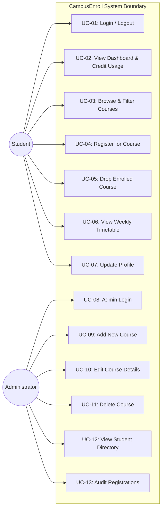

# Use Case Specifications
## CampusEnroll – Student Course Registration System

### 1. Actors
1. **Student**: Undergraduate or postgraduate learner registering for courses.
2. **Administrator**: Institutional academic coordinator managing courses and records.
3. **Database System (SQLite)**: Underlying persistence store maintaining transactional integrity and constraints.

---

### 2. High-Level Use Case Diagram (Mermaid)

---

### 3. Detailed Use Case Specifications

#### UC-01: Student Authentication
- **Primary Actor**: Student
- **Pre-conditions**: Student profile exists in `students` table.
- **Main Flow**:
  1. Student navigates to `/login`.
  2. Student inputs Student ID or registered email and password.
  3. System validates credentials against database using parameterized query.
  4. System initializes session (`user_id`, `role='student'`, `name`, `student_id`).
  5. Student is redirected to `/dashboard` with a welcome banner.
- **Alternate Flow (Invalid Credentials)**:
  - If credentials do not match, system flashes "Invalid Student ID/Email or password" and retains user on login page.

---

#### UC-02: Browse & Filter Courses
- **Primary Actor**: Student
- **Pre-conditions**: Student is authenticated.
- **Main Flow**:
  1. Student clicks on "Browse Courses".
  2. System queries all courses and flags courses the student has already enrolled in.
  3. Student specifies search keywords or selects Department, Semester, or Credits filter.
  4. System returns the filtered list with seating capacity indicators.

---

#### UC-03: Register for Course
- **Primary Actor**: Student
- **Pre-conditions**: Student is logged in; course catalog is accessible.
- **Main Flow**:
  1. Student reviews available course and clicks "Register Course".
  2. System checks if student is already enrolled in the course.
  3. System verifies `available_seats > 0`.
  4. System calculates `current_student_credits + course.credits`.
  5. System validates that the sum does not exceed `MAX_CREDIT_LIMIT` (24 credits).
  6. System creates a new row in `registrations` table.
  7. System atomically decrements `available_seats` by 1.
  8. System commits transaction and displays success message.
- **Alternate Flows**:
  - **Duplicate Attempt**: If already registered, system rejects with warning: "You are already registered for this course."
  - **Course Full**: If seats are 0, system rejects with danger message: "Course is currently full (0 seats available)."
  - **Credit Overload**: If credits exceed 24, system rejects with error: "Cannot register: Adding this course exceeds your semester credit limit of 24 credits."

---

#### UC-04: Drop Registered Course
- **Primary Actor**: Student
- **Pre-conditions**: Student is enrolled in the selected course.
- **Main Flow**:
  1. Student navigates to `/my-courses`.
  2. Student clicks "Drop Course" next to the target course.
  3. System prompts confirmation modal: *"Are you sure you want to drop course...?"*
  4. Upon confirmation, system deletes record from `registrations`.
  5. System atomically increments `available_seats` by 1.
  6. System refreshes page displaying updated registered credits and remaining capacity.

---

#### UC-05: View Weekly Timetable
- **Primary Actor**: Student
- **Pre-conditions**: Student is logged in.
- **Main Flow**:
  1. Student selects "Timetable" from navigation menu.
  2. System loads student's registered courses.
  3. System maps course schedule strings into Monday–Friday columns.
  4. Student views their personalized weekly class schedule with course titles, faculty names, and time slots.

---

#### UC-06: Student Profile Update
- **Primary Actor**: Student
- **Pre-conditions**: Student is logged in.
- **Main Flow**:
  1. Student navigates to `/profile`.
  2. System displays academic metadata (Roll ID, department, semester, credit load).
  3. Student enters updated phone number, email address, or new password.
  4. System validates email uniqueness and commits changes.

---

#### UC-07: Admin Add Course
- **Primary Actor**: Administrator
- **Pre-conditions**: Administrator is logged into the `/admin/dashboard`.
- **Main Flow**:
  1. Admin clicks "Add New Course".
  2. Admin enters code (e.g., `CS401`), title, department, semester, credits, faculty, maximum seats, and schedule.
  3. System validates required inputs and positive numeric ranges.
  4. System verifies uniqueness of course code.
  5. System inserts course with `available_seats = max_seats`.
  6. Admin is redirected to `/admin/courses` with success confirmation.

---

#### UC-08: Admin Delete Course
- **Primary Actor**: Administrator
- **Pre-conditions**: Course exists in database.
- **Main Flow**:
  1. Admin locates course in `/admin/courses` and clicks "Delete".
  2. System displays safety confirmation prompt.
  3. Upon confirmation, system deletes course and cascades removal of related student registrations.
  4. System updates course inventory view.
